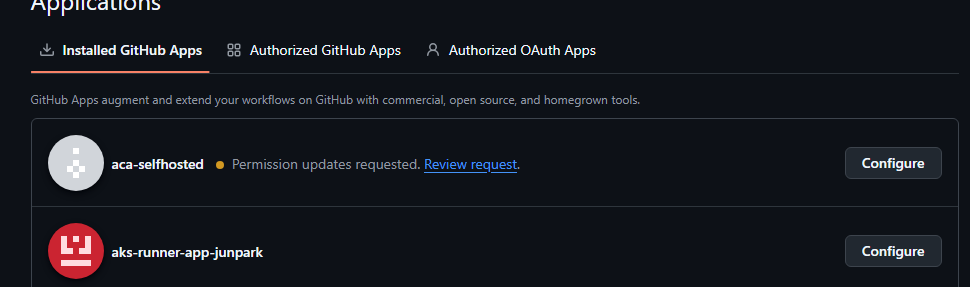
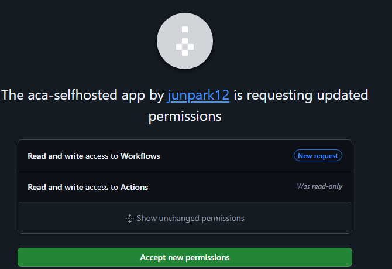

# Azure Container Apps + KEDA로 GitHub Actions Self-hosted Runner 구성하기 (Private 환경 / GitHub App 인증)

> 원문: [Running GitHub Actions Runners on Azure Container Apps with KEDA Autoscaling](https://techcommunity.microsoft.com/blog/azureinfrastructureblog/running-github-actions-runners-on-azure-container-apps-with-keda-autoscaling/4512980) (Microsoft Tech Community)
>
> ⚠️ 원문은 **Public 접근 + PAT 인증 + Portal 조작** 기준으로 작성되었습니다. 본 문서는 다음 전제로 재구성했습니다.
> - **Private 환경**: Container Apps Environment는 Internal(인바운드 차단) + UDR/Azure Firewall(아웃바운드 화이트리스트) 구성, ACR/Key Vault는 Private Endpoint 사용
> - **모든 명령은 Bicep/Portal이 아닌 az CLI로 통일**
> - **인증은 PAT이 아닌 GitHub App** 사용 (원문의 "운영 환경 권장" 옵션을 기본값으로 채택)

## 1. 배경 및 목적

GitHub-hosted runner로 부족한 아래 요구사항을 해결하기 위한 서버리스 self-hosted runner 구성입니다.

- 비용 최적화 — 잡 실행 시에만 과금 (유휴 시 0)
- 실행 환경/설치 도구에 대한 완전한 제어권
- 대규모 병렬 실행
- 사내 DB, 내부 API 등 **private 리소스 네트워크 접근**

VM 기반 self-hosted runner의 상시 기동 비용·수동 스케일링·패치 부담을 **Azure Container Apps Jobs + KEDA autoscaling**으로 해결합니다.

## 2. 결과물 요약

| 항목 | 내용 |
|---|---|
| Runner 유형 | Self-hosted, Ephemeral (1 Job = 1 Container, 1회성) |
| 스케일링 | KEDA가 자동 처리, 유휴 시 0으로 스케일다운 |
| 인바운드 | 없음 (Container Apps Environment Internal-only) |
| 아웃바운드 | UDR로 Azure Firewall 강제 경유, FQDN 화이트리스트로만 허용 |
| 인증 | GitHub App (App ID + Installation ID + Private Key), Key Vault + Managed Identity |

## 3. 동작 흐름

1. 개발자가 코드 푸시 / 워크플로우 트리거
2. GitHub이 잡을 큐에 등록, 라벨이 일치하는 runner 탐색
3. KEDA가 GitHub Actions API를 폴링 (GitHub App 토큰으로 인증, rate limit 15,000/hr)
4. 대기 잡 감지 → Container App Job 실행 트리거
5. 컨테이너가 시작되며 GitHub App 인증으로 JWT → Installation Token → Registration Token 획득 후 self-hosted runner로 등록
6. Runner가 잡을 수신·실행·결과 보고
7. 컨테이너 종료 (ephemeral) → 대기 잡 없으면 KEDA가 0으로 스케일다운

## 4. Private 네트워크 아키텍처

```
[Internet] ⇄ (제한된 FQDN만) ⇄ [Azure Firewall] ⇄ (UDR 0.0.0.0/0) ⇄ [Container Apps Env - Internal, infra-subnet]
                                                                         │
                                                    Private Endpoint ────┼──── ACR (Public access Disabled)
                                                    Private Endpoint ────┴──── Key Vault (Public access Disabled)
```

- **인바운드 차단**: Container Apps Environment를 `--internal-only true`로 생성 → 공인 엔드포인트 없음
- **아웃바운드 화이트리스트**: infra-subnet에 UDR(`0.0.0.0/0 → Firewall Private IP`) 연결, Firewall Application/Network Rule로 아래 대상만 허용 (개념 요약 — 최종 상세 규칙 및 실제 필요했던 전체 FQDN/서비스 태그 목록은 **[7.3 Azure Firewall + 아웃바운드 화이트리스트 + UDR](#73-azure-firewall--아웃바운드-화이트리스트--udr)** 참조)
  - `github.com` (runner 등록)
  - `api.github.com` (KEDA 폴링 + GitHub App 토큰 발급)
  - `*.actions.githubusercontent.com` (액션 다운로드)
  - `codeload.github.com` (git clone/checkout)
  - `objects.githubusercontent.com`, `github-releases.githubusercontent.com` (runner 바이너리/릴리스 다운로드)
  - (워크로드에 따라 패키지 레지스트리, Azure 플랫폼(AAD/ARM/App Service), Managed Identity/ACR용 서비스 태그 Network Rule 등 추가 구성 필요 — 상세는 7.3)
- **PaaS 접근은 Private Endpoint**: ACR, Key Vault는 Public network access 비활성화 + Private Endpoint + Private DNS Zone

> ⚠️ **UDR은 "Consumption only(legacy)" 환경에서는 지원되지 않습니다.** Azure Container Apps 환경은 두 가지 타입이 있습니다.
>
> | Environment type | 지원 플랜 | UDR/NAT Gateway/Private Endpoint(환경) |
> |---|---|---|
> | **Workload profiles (기본, 권장)** | Consumption, Dedicated | ✅ 지원 (최소 subnet `/27`) |
> | Consumption only (legacy) | Consumption만 | ❌ 미지원 (최소 subnet `/23`) |
>
> 따라서 본 문서처럼 Azure Firewall로 아웃바운드를 통제하려면 **`--enable-workload-profiles` 옵션으로 환경을 생성**해야 합니다. Workload profiles 환경에도 **Consumption 프로필이 기본 포함**되므로, Job은 여전히 Consumption(서버리스, scale-to-zero) 방식으로 과금됩니다 — Dedicated 프로필을 별도로 추가하지 않는 한 상시 기동 비용은 발생하지 않습니다.

### 4.1 Consumption 프로필로도 사내 DB/내부 API(Private 리소스) 접근이 가능한 이유

**VNet 연결은 "프로필(Consumption/Dedicated) 단위"가 아니라 "환경(Environment) 단위"로 적용됩니다.** 즉, 같은 환경에 배포된 Job/App은 프로필 종류와 무관하게 **동일한 infra-subnet, 동일한 UDR, 동일한 아웃바운드 경로**를 공유합니다 ([Microsoft Learn - Environments](https://learn.microsoft.com/en-us/azure/container-apps/environment): "여러 Container App이 같은 환경에 있으면 동일한 virtual network를 공유"). Consumption/Dedicated의 차이는 **컴퓨팅 격리 방식과 과금 방식**일 뿐, 네트워크 도달 범위(reachability)와는 무관합니다.

따라서 이 문서의 runner Job(Consumption 프로필)도 아래 조건이 맞으면 사내 DB/내부 API에 정상 접근합니다.

- Container Apps VNet(`$VNET_NAME`)이 사내 DB/API가 있는 VNet과 **VNet Peering** 되어 있거나, Hub-Spoke 구조에서 **ExpressRoute/VPN Gateway를 경유해 온프레미스와 연결**되어 있을 것
- infra-subnet의 UDR(`0.0.0.0/0 → Firewall`)에서 **사내 대역(예: `10.0.0.0/8`, 온프레미스 CIDR)에 대한 트래픽은 Firewall의 Network/Application Rule에서 허용**하거나, 필요 시 해당 대역만 Firewall을 우회해 직접 Peering/Gateway로 라우팅되도록 UDR을 세분화 (Azure는 더 구체적인 prefix의 라우팅을 우선 적용하므로 `0.0.0.0/0`보다 더 좁은 사내 대역 UDR을 추가하면 Firewall 없이 바로 라우팅 가능)
- 사내 DNS(프라이빗 존)를 사용하는 경우, Container Apps Environment VNet에 해당 **Private DNS Zone이 연결**되어 있거나 커스텀 DNS 서버가 지정되어 있을 것

> 💡 요약: "Consumption profile = 서버리스/scale-to-zero", "Workload profiles 환경 = VNet·UDR·Private Endpoint 지원"은 서로 다른 축입니다. 이 문서는 **Workload profiles 환경 + Consumption profile** 조합이므로 **비용 효율성과 사내 네트워크 접근성을 동시에** 확보합니다.

## 5. 사전 요구사항

- GitHub 조직 관리자 권한 (GitHub App 생성/설치 가능해야 함)
- Azure 구독 (Contributor 이상), Azure CLI (`az`) 또는 Azure Cloud Shell
- (신규 구성 시) 격리된 VNet을 새로 만들거나, 기존 Hub-Spoke VNet에 Subnet을 추가할 권한

## 6. GitHub App 생성 (Step 1)

CLI로는 생성 불가 (GitHub UI에서만 가능). 아래 절차로 준비합니다.

1. `github.com` → 조직 → **Settings → Developer settings → GitHub Apps → New GitHub App**
2. Webhook: **비활성화(Disable)** (필요 없음)
3. 권한(Permissions) 설정 (실제 검증 완료된 조합 — `aca-selfhosted` App 기준):
   - **Repository permissions** (4개 선택, Metadata는 mandatory 자동 선택):
     | 권한 | Access | 비고 |
     |---|---|---|
     | Actions | **Read and write** | 워크플로우 실행/아티팩트 관리 (Read-only만으론 KEDA 폴링은 되지만 일부 API 제약 가능) |
     | Administration | **Read and write** | 필수 — registration-token 발급에 write 권한 요구 |
     | Metadata | Read-only (mandatory) | 자동 선택, 변경 불가 |
     | Workflows | **Read and write** | 워크플로우 파일 갱신 시 필요 (runner 등록 자체엔 필수는 아니지만 문서 기준 포함 권장) |
   - **Organization permissions** (org-level runner 사용 시만, 1개 선택):
     | 권한 | Access | 비고 |
     |---|---|---|
     | Self-hosted runners | **Read and write** | org-level runner 등록/관리에 필요 |

   > 개인 계정(repo-level) 사용 시 Organization permissions는 설정해도 실제로 적용되지 않습니다(조직 컨텍스트가 없으므로 무시됨) — 개인 계정이라면 Repository permissions 4개만 있으면 충분합니다.
4. 생성 후 **App ID** 기록
5. **Generate a private key** → `.pem` 파일 다운로드 (한 번만 표시됨, 안전하게 보관)
6. **조직/리포지토리에 App 설치(Install)** → URL의 Installation ID 기록 (`https://github.com/organizations/<org>/settings/installations/<installation_id>`)
7. 필요 시 **Runner Group** 생성 (org-level runner를 특정 repo로 제한). Public repo가 있다면 "Allow public repositories" 체크 필수 — 안 하면 job이 Queued에서 멈추는 가장 흔한 문제

> GitHub App 인증은 PAT 대비 **① 개인 계정에 종속되지 않음, ② rate limit 15,000/hr(PAT는 5,000/hr), ③ 세분화된 권한**의 장점이 있습니다.

### 6.1 이미 설치된 App의 권한을 나중에 변경한 경우 — 재승인(Review request) 필요

App을 설치한 **뒤에** GitHub App 설정 화면에서 권한을 추가/변경(예: Workflows 권한 신규 추가, Actions를 Read-only → Read and write로 변경)하면, **기존 설치(installation)에는 자동으로 반영되지 않습니다.** GitHub API로 설치 정보를 조회해 보면 예전 권한 그대로 남아있는 것을 확인할 수 있습니다 (예: `actions: "read"`, `workflows` 키 자체가 없음).

이 경우 App 소유 계정에 **"Permission updates requested"** 알림이 뜨며, 아래 절차로 재승인해야 새 권한이 실제로 적용됩니다.

1. `https://github.com/settings/installations` 접속 (조직 소유라면 `https://github.com/organizations/<org>/settings/installations`)
2. 대상 App 옆에 🟠 **"Permission updates requested. [Review request](https://github.com/settings/installations)"** 문구가 표시됨

   

3. **Review request** 클릭 → 변경된 권한만 비교해서 보여주는 승인 화면이 뜸 (신규 추가된 권한은 "New request", 기존 대비 상향된 권한은 "Was read-only" 등으로 표시)

   

4. 내용 확인 후 **Accept new permissions** 클릭 → 즉시 설치에 새 권한 반영

> ⚠️ 이 재승인을 하지 않아도 **`administration:write`, `actions:read`만 있으면 runner 등록 및 KEDA 폴링은 정상 동작**합니다. `workflows` 권한은 워크플로우 파일 자체를 수정하는 경우에만 필요하므로, 당장 테스트가 급하다면 건너뛰어도 무방합니다. 다만 App 설정과 실제 부여된 권한을 일치시키려면 재승인을 완료하는 것을 권장합니다.

## 7. Azure 리소스 생성 (전체 az CLI)

### 7.1 공통 변수

```bash
SUBSCRIPTION_ID="<your-subscription-id>"
RESOURCE_GROUP="rg-github-runners"
LOCATION="koreacentral"
VNET_NAME="vnet-github-runners"
INFRA_SUBNET="snet-aca-infra"
PE_SUBNET="snet-private-endpoints"
FW_SUBNET="AzureFirewallSubnet"        # Azure Firewall은 이 이름 고정
ACR_NAME="acrgithubrunners"            # 전역 고유, 소문자/숫자만
KV_NAME="kv-github-runners"            # 전역 고유
CAE_NAME="cae-github-runners"
JOB_NAME="github-runner-job"
IMAGE_NAME="github-runner"
IMAGE_TAG="v1"
FW_NAME="fw-github-runners"
FW_POLICY_NAME="fwpol-github-runners"
ROUTE_TABLE_NAME="rt-aca-infra"

az account set --subscription "$SUBSCRIPTION_ID"
az group create --name $RESOURCE_GROUP --location $LOCATION
```

### 7.2 VNet / Subnet 생성

```bash
# VNet 생성
az network vnet create \
  --resource-group $RESOURCE_GROUP --name $VNET_NAME \
  --location $LOCATION --address-prefix 10.10.0.0/16

# Container Apps 인프라용 Subnet (Workload profiles 환경 최소 /27 — UDR 지원을 위해 필요, 넉넉하게 /23으로 생성)
az network vnet subnet create \
  --resource-group $RESOURCE_GROUP --vnet-name $VNET_NAME \
  --name $INFRA_SUBNET --address-prefixes 10.10.0.0/23 \
  --delegations Microsoft.App/environments

# Private Endpoint용 Subnet (ACR, Key Vault)
az network vnet subnet create \
  --resource-group $RESOURCE_GROUP --vnet-name $VNET_NAME \
  --name $PE_SUBNET --address-prefixes 10.10.2.0/27 \
  --disable-private-endpoint-network-policies true

# Azure Firewall 전용 Subnet (이름 고정, 최소 /26)
az network vnet subnet create \
  --resource-group $RESOURCE_GROUP --vnet-name $VNET_NAME \
  --name $FW_SUBNET --address-prefixes 10.10.3.0/26
```

### 7.3 Azure Firewall + 아웃바운드 화이트리스트 + UDR

> ⚠️ **Internal-only(Private) Container Apps 환경은 GitHub 통신뿐 아니라 Azure 플랫폼 자체의 필수 트래픽(Managed Identity 인증, ACR 이미지 Pull, App Service 배포 등)까지 모두 Firewall을 통과해야 합니다.** 아래는 이번 구성에서 실제로 필요했던 **최종** 규칙 3종(Application Rule 2개 + Network Rule 1개)입니다. Application Rule(FQDN 기반)만으로는 부족하며, Managed Identity 인증은 반드시 **Network Rule(서비스 태그 기반)** 로 허용해야 합니다.

```bash
# Firewall용 공인 IP + Firewall 생성
az network public-ip create --resource-group $RESOURCE_GROUP \
  --name pip-fw-github-runners --sku Standard --allocation-method Static

az network firewall create --resource-group $RESOURCE_GROUP \
  --name $FW_NAME --location $LOCATION

az network firewall ip-config create --resource-group $RESOURCE_GROUP \
  --firewall-name $FW_NAME --name fw-ipconfig \
  --public-ip-address pip-fw-github-runners --vnet-name $VNET_NAME

FW_PRIVATE_IP=$(az network firewall ip-config list \
  --resource-group $RESOURCE_GROUP --firewall-name $FW_NAME \
  --query "[0].privateIPAddress" -o tsv)

# 1) GitHub 통신 + 워크플로우 자산 다운로드(Node.js, npm 등) + Actions 로그 업로드용 Application Rule
az network firewall application-rule create \
  --resource-group $RESOURCE_GROUP --firewall-name $FW_NAME \
  --collection-name "github-runner-rules" --priority 200 --action Allow \
  --name "allow-github" \
  --source-addresses "10.10.0.0/23" \
  --protocols "Https=443" "Http=80" \
  --target-fqdns \
    "github.com" "api.github.com" \
    "*.actions.githubusercontent.com" \
    "codeload.github.com" \
    "objects.githubusercontent.com" \
    "github-releases.githubusercontent.com" \
    "release-assets.githubusercontent.com" \
    "raw.githubusercontent.com" \
    "nodejs.org" "*.nodejs.org" \
    "registry.npmjs.org" \
    "*.blob.core.windows.net"

# 2) AAD 인증(CLI) + App Service 배포(SCM/Kudu Zip Deploy)용 Application Rule
az network firewall application-rule create \
  --resource-group $RESOURCE_GROUP --firewall-name $FW_NAME \
  --collection-name "azure-platform-rules" --priority 220 --action Allow \
  --name "allow-azure-ad-auth" \
  --source-addresses "10.10.0.0/23" \
  --protocols "Https=443" \
  --target-fqdns "login.microsoftonline.com" "management.azure.com" "graph.microsoft.com" \
    "*.azurewebsites.net" "*.scm.azurewebsites.net"

# 3) Container Apps 플랫폼 필수 아웃바운드(Managed Identity 토큰 발급, 이미지 Pull, 진단 로그)용 Network Rule
#    -- 서비스 태그 기반이므로 Application Rule이 아닌 Network Rule로 구성해야 합니다.
az network firewall network-rule create \
  --resource-group $RESOURCE_GROUP --firewall-name $FW_NAME \
  --collection-name "aca-platform-network-rules" --priority 210 --action Allow \
  --name "allow-aca-platform" \
  --source-addresses "10.10.0.0/23" \
  --protocols "TCP" \
  --destination-ports "443" \
  --destination-addresses \
    "AzureActiveDirectory" "AzureContainerRegistry" "MicrosoftContainerRegistry" \
    "AzureFrontDoor.FirstParty" "AzureMonitor" "Storage.<Region>"

# infra-subnet의 모든 아웃바운드를 Firewall로 강제 라우팅
az network route-table create --resource-group $RESOURCE_GROUP --name $ROUTE_TABLE_NAME

az network route-table route create --resource-group $RESOURCE_GROUP \
  --route-table-name $ROUTE_TABLE_NAME --name "default-to-firewall" \
  --address-prefix "0.0.0.0/0" --next-hop-type VirtualAppliance \
  --next-hop-ip-address $FW_PRIVATE_IP

az network vnet subnet update --resource-group $RESOURCE_GROUP \
  --vnet-name $VNET_NAME --name $INFRA_SUBNET --route-table $ROUTE_TABLE_NAME
```

| 규칙 유형 | 컬렉션 | 대상 | 용도 |
|---|---|---|---|
| Application Rule (FQDN) | `github-runner-rules` | GitHub 통신, Node.js/npm 다운로드, Actions 로그 업로드(`*.blob.core.windows.net`) | 워크플로우 실행 자체(체크아웃, 빌드, 테스트) |
| Application Rule (FQDN) | `azure-platform-rules` | AAD 인증, App Service 관리/배포(SCM·Kudu) | `az login --identity` 이후 ARM 호출, `az webapp deploy` |
| Network Rule (서비스 태그) | `aca-platform-network-rules` | `AzureActiveDirectory`, `AzureContainerRegistry`, `MicrosoftContainerRegistry`, `AzureFrontDoor.FirstParty`, `AzureMonitor`, `Storage.<Region>` | Managed Identity 토큰 발급, ACR 이미지 Pull, 시스템 컨테이너, 진단 로그 — **Application Rule로는 대체 불가** |

> ⚠️ Network Rule이 없으면 러너 자체는 GitHub에 정상 등록되어 잡을 수신하더라도, Managed Identity를 사용하는 모든 후속 작업(`az login --identity` 등)이 `500 (invalid_scope)` 오류로 실패합니다. (참고: [Securing a Virtual Network in Azure Container Apps](https://learn.microsoft.com/azure/container-apps/firewall-integration))

#### 7.3.1 사내 DB/내부 API(Private 리소스) 접근 허용 (선택 사항)

Runner가 워크플로우 실행 중 사내 리소스에 접근해야 한다면 아래 둘 중 하나(또는 둘 다)를 구성합니다.

**옵션 A. Firewall Network Rule로 사내 대역 허용 (Firewall을 계속 경유)**

```bash
az network firewall network-rule create \
  --resource-group $RESOURCE_GROUP --firewall-name $FW_NAME \
  --collection-name "internal-resource-rules" --priority 215 --action Allow \
  --name "allow-internal-db-api" \
  --source-addresses "10.10.0.0/23" \
  --destination-addresses "10.20.0.0/16" \
  --destination-ports "443" "1433" \
  --protocols "TCP"
# destination-addresses/ports는 실제 사내 DB·API 대역/포트로 교체
```

**옵션 B. 사내 대역은 Firewall을 우회해 Peering/Gateway로 직접 라우팅 (더 좁은 prefix 우선 적용)**

```bash
az network route-table route create --resource-group $RESOURCE_GROUP \
  --route-table-name $ROUTE_TABLE_NAME --name "route-to-onprem-via-peering" \
  --address-prefix "10.20.0.0/16" --next-hop-type VNetPeering
# 온프레미스 경유(ExpressRoute/VPN Gateway)라면 next-hop-type을 VirtualNetworkGateway로 지정
```

> Azure 라우팅은 **가장 구체적인(prefix가 긴) 경로를 우선 적용**하므로, `10.20.0.0/16` 같은 사내 대역 경로가 `0.0.0.0/0 → Firewall` 기본 경로보다 먼저 매칭되어 Firewall을 거치지 않고 바로 Peering/Gateway로 라우팅됩니다. 보안 감사(트래픽 검사)가 필요하면 옵션 A, 성능/단순성이 우선이면 옵션 B를 선택하세요.

### 7.4 ACR (Private Endpoint, Public access 비활성화)

```bash
az acr create --resource-group $RESOURCE_GROUP --name $ACR_NAME --sku Premium
# Private Endpoint는 Premium tier 필요

az acr update --name $ACR_NAME --public-network-enabled false

az network private-dns zone create --resource-group $RESOURCE_GROUP \
  --name "privatelink.azurecr.io"

az network private-dns link vnet create --resource-group $RESOURCE_GROUP \
  --zone-name "privatelink.azurecr.io" --name "acr-dns-link" \
  --virtual-network $VNET_NAME --registration-enabled false

ACR_ID=$(az acr show --name $ACR_NAME --query id -o tsv)

az network private-endpoint create --resource-group $RESOURCE_GROUP \
  --name "pe-acr" --vnet-name $VNET_NAME --subnet $PE_SUBNET \
  --private-connection-resource-id $ACR_ID --group-id registry \
  --connection-name "acr-connection"

az network private-endpoint dns-zone-group create --resource-group $RESOURCE_GROUP \
  --endpoint-name "pe-acr" --name "acr-zone-group" \
  --private-dns-zone "privatelink.azurecr.io" --zone-name "acr"
```

### 7.5 Key Vault (Private Endpoint, Public access 비활성화)

```bash
az keyvault create --resource-group $RESOURCE_GROUP --name $KV_NAME \
  --location $LOCATION --enable-rbac-authorization true --public-network-access Disabled

az network private-dns zone create --resource-group $RESOURCE_GROUP \
  --name "privatelink.vaultcore.azure.net"

az network private-dns link vnet create --resource-group $RESOURCE_GROUP \
  --zone-name "privatelink.vaultcore.azure.net" --name "kv-dns-link" \
  --virtual-network $VNET_NAME --registration-enabled false

KV_ID=$(az keyvault show --name $KV_NAME --query id -o tsv)

az network private-endpoint create --resource-group $RESOURCE_GROUP \
  --name "pe-kv" --vnet-name $VNET_NAME --subnet $PE_SUBNET \
  --private-connection-resource-id $KV_ID --group-id vault \
  --connection-name "kv-connection"

az network private-endpoint dns-zone-group create --resource-group $RESOURCE_GROUP \
  --endpoint-name "pe-kv" --name "kv-zone-group" \
  --private-dns-zone "privatelink.vaultcore.azure.net" --zone-name "vault"

# 본인 계정에 시크릿 등록 권한 부여 (RBAC)
MY_OBJECT_ID=$(az ad signed-in-user show --query id -o tsv)
az role assignment create --assignee $MY_OBJECT_ID \
  --role "Key Vault Secrets Officer" --scope $KV_ID
```

### 7.6 GitHub App 자격 증명을 Key Vault에 저장

```bash
# App ID, Installation ID는 메타데이터로 사용되므로 시크릿일 필요는 없지만 관리 편의상 함께 저장 가능
az keyvault secret set --vault-name $KV_NAME --name "github-app-id" --value "<APP_ID>"
az keyvault secret set --vault-name $KV_NAME --name "github-app-installation-id" --value "<INSTALLATION_ID>"

# Private Key(.pem) 파일 내용을 시크릿으로 저장 (KEDA appKey 인증에 사용)
az keyvault secret set --vault-name $KV_NAME --name "github-app-private-key" \
  --file "/path/to/your-github-app.private-key.pem"
```

## 8. Runner Docker 이미지 (GitHub App 인증 반영)

### 8.1 `start.sh` — GitHub App JWT → Installation Token → Registration Token

```bash
#!/bin/bash
set -e

# 환경 변수
# GITHUB_APP_ID              → GitHub App ID
# GITHUB_APP_INSTALLATION_ID → GitHub App Installation ID
# GITHUB_APP_PRIVATE_KEY     → GitHub App 개인키(.pem) 내용 (Key Vault 참조로 주입)
# GITHUB_OWNER                → GitHub org/사용자명
# GITHUB_REPO                 → (repo-level인 경우만) 리포지토리명
# RUNNER_SCOPE                → org 또는 repo
# RUNNER_LABELS               → 콤마 구분 라벨
# RUNNER_GROUP                → runner group 이름 (org-level)

RUNNER_SCOPE="${RUNNER_SCOPE:-org}"
RUNNER_LABELS="${RUNNER_LABELS:-container-app}"
RUNNER_GROUP="${RUNNER_GROUP:-Default}"

b64url() { openssl base64 -e -A | tr '+/' '-_' | tr -d '='; }

echo "🔑 GitHub App JWT 생성 중..."
NOW=$(date +%s)
IAT=$((NOW - 60))
EXP=$((NOW + 540))
HEADER=$(printf '{"alg":"RS256","typ":"JWT"}' | b64url)
PAYLOAD=$(printf '{"iat":%s,"exp":%s,"iss":"%s"}' "$IAT" "$EXP" "$GITHUB_APP_ID" | b64url)
UNSIGNED="${HEADER}.${PAYLOAD}"
SIGNATURE=$(printf '%s' "$UNSIGNED" | openssl dgst -sha256 -sign <(printf '%s' "$GITHUB_APP_PRIVATE_KEY") | b64url)
JWT="${UNSIGNED}.${SIGNATURE}"

echo "🔑 Installation Access Token 요청 중..."
INSTALL_TOKEN=$(curl -s -X POST \
    -H "Authorization: Bearer ${JWT}" \
    -H "Accept: application/vnd.github+json" \
    "https://api.github.com/app/installations/${GITHUB_APP_INSTALLATION_ID}/access_tokens" \
    | jq -r .token)

if [ -z "$INSTALL_TOKEN" ] || [ "$INSTALL_TOKEN" == "null" ]; then
    echo "❌ Installation Token 발급 실패. App ID/Installation ID/Private Key를 확인하세요."
    exit 1
fi

if [ "$RUNNER_SCOPE" == "org" ]; then
    echo "🔑 조직 등록 토큰 요청 중: $GITHUB_OWNER"
    REG_TOKEN=$(curl -s -X POST \
        -H "Authorization: token ${INSTALL_TOKEN}" \
        -H "Accept: application/vnd.github+json" \
        "https://api.github.com/orgs/${GITHUB_OWNER}/actions/runners/registration-token" \
        | jq -r .token)
    RUNNER_URL="https://github.com/${GITHUB_OWNER}"
else
    echo "🔑 리포지토리 등록 토큰 요청 중: $GITHUB_OWNER/$GITHUB_REPO"
    REG_TOKEN=$(curl -s -X POST \
        -H "Authorization: token ${INSTALL_TOKEN}" \
        -H "Accept: application/vnd.github+json" \
        "https://api.github.com/repos/${GITHUB_OWNER}/${GITHUB_REPO}/actions/runners/registration-token" \
        | jq -r .token)
    RUNNER_URL="https://github.com/${GITHUB_OWNER}/${GITHUB_REPO}"
fi

if [ -z "$REG_TOKEN" ] || [ "$REG_TOKEN" == "null" ]; then
    echo "❌ 등록 토큰 발급 실패. GitHub App 권한(Administration Read&Write 등)을 확인하세요."
    exit 1
fi

echo "✅ 등록 토큰 획득 성공"

echo "⚙️ Runner 구성 중..."
./config.sh --unattended \
    --name "runner-$(hostname)" \
    --url "$RUNNER_URL" \
    --token "$REG_TOKEN" \
    --runnergroup "$RUNNER_GROUP" \
    --ephemeral \
    --labels "$RUNNER_LABELS" \
    --replace
# ⚠️ --disableupdate 플래그는 사용하지 말 것 (최신 GitHub에서 job을 못 받는 원인)

echo "🚀 Runner 시작..."
./run.sh
```

### 8.2 `Dockerfile`

```dockerfile
FROM ubuntu:22.04

ENV DEBIAN_FRONTEND=noninteractive

RUN apt-get update && apt-get install -y \
    curl \
    git \
    jq \
    ca-certificates \
    unzip \
    zip \
    wget \
    apt-transport-https \
    software-properties-common \
    lsb-release \
    gnupg \
    openssl \
    && rm -rf /var/lib/apt/lists/*

# Azure CLI - Container App Job의 system-assigned Managed Identity로
# 'az login --identity' 후 'az webapp deploy'를 실행하기 위해 필요
RUN curl -sL https://aka.ms/InstallAzureCLIDeb | bash

RUN useradd -m runner
WORKDIR /home/runner/actions-runner

# 최신 버전 확인: curl -s https://api.github.com/repos/actions/runner/releases/latest | jq -r '.tag_name'
ARG RUNNER_VERSION=2.335.1
RUN curl -L -o actions-runner.tar.gz \
    "https://github.com/actions/runner/releases/download/v${RUNNER_VERSION}/actions-runner-linux-x64-${RUNNER_VERSION}.tar.gz" \
    && tar xzf actions-runner.tar.gz \
    && rm actions-runner.tar.gz

RUN ./bin/installdependencies.sh

COPY start.sh .
RUN chmod +x start.sh \
    && chown -R runner:runner /home/runner

USER runner
ENTRYPOINT ["./start.sh"]
```

> ⚠️ 오래된 `RUNNER_VERSION` 사용 시 `Runner version vX.X.X is deprecated and cannot receive messages.` 오류가 발생하므로 항상 최신 버전을 확인하세요.
>
> ⚠️ **`zip`, Azure CLI는 워크플로우가 실제로 사용하는 도구에 맞춰 추가된 패키지입니다.** `az webapp deploy`(zip 배포)를 Managed Identity로 수행하려면 Azure CLI가 이미지에 반드시 포함되어야 합니다(§20.3 참고). **Dockerfile을 수정한 뒤에는 반드시 `az acr build`로 이미지를 재빌드/재푸시해야 변경 사항이 반영됩니다** — Job은 ACR의 태그(`:v1`)를 그대로 참조하므로, 재빌드를 잊으면 이전 이미지가 계속 실행되어 원인 파악이 어려운 실패(예: `az: command not found`)가 발생할 수 있습니다.

## 9. 이미지 빌드 (Docker 불필요, ACR Tasks 사용 — Private 환경 권장)

```bash
cd github-runner-image   # Dockerfile, start.sh 위치 폴더

az acr login --name $ACR_NAME 2>/dev/null || true
az acr build --registry $ACR_NAME --image $IMAGE_NAME:$IMAGE_TAG --file Dockerfile .
```

> ACR이 Public access 비활성화 상태이면 `az acr build`도 ACR 접근 권한이 있는 자격 증명(로그인 세션)으로 Azure 내부 빌드 에이전트를 사용하므로 대부분 문제 없이 동작합니다. 사내 CI 파이프라인(Private Agent)에서 실행하는 것을 권장합니다.

## 10. Container Apps Environment 생성 (Internal-only, Workload Profiles — UDR 지원 필수)

```bash
INFRA_SUBNET_ID=$(az network vnet subnet show \
  --resource-group $RESOURCE_GROUP --vnet-name $VNET_NAME --name $INFRA_SUBNET \
  --query id -o tsv)

# --enable-workload-profiles 필수: UDR/NAT Gateway/환경 내 Private Endpoint는
# Workload profiles 환경에서만 지원되며, Consumption-only(legacy) 환경은 UDR을 지원하지 않음
az containerapp env create \
  --name $CAE_NAME --resource-group $RESOURCE_GROUP --location $LOCATION \
  --infrastructure-subnet-resource-id $INFRA_SUBNET_ID \
  --internal-only true \
  --enable-workload-profiles true
```

> Workload profiles 환경을 생성하면 기본적으로 `Consumption` 프로필이 자동 포함됩니다. 별도로 Dedicated 프로필을 추가하지 않으면 Job은 그대로 서버리스 Consumption 과금(유휴 시 0)으로 동작합니다.

## 11. Container App Job 생성 + Managed Identity + KEDA (GitHub App 인증)

```bash
# 11.1 Job 생성 (Managed Identity, ACR, 기본 스케일 설정 포함)
# --workload-profile-name Consumption: Workload profiles 환경에서 Job이 사용할 프로필 명시 (서버리스 과금 유지)
az containerapp job create \
  --name $JOB_NAME --resource-group $RESOURCE_GROUP \
  --environment $CAE_NAME --trigger-type Event \
  --workload-profile-name "Consumption" \
  --replica-timeout 1800 --replica-retry-limit 1 \
  --replica-completion-count 1 --parallelism 1 \
  --image "$ACR_NAME.azurecr.io/$IMAGE_NAME:$IMAGE_TAG" \
  --cpu "0.5" --memory "1Gi" \
  --min-executions 0 --max-executions 5 --polling-interval 30 \
  --registry-server "$ACR_NAME.azurecr.io" --registry-identity "system" \
  --mi-system-assigned

JOB_ID=$(az containerapp job show --name $JOB_NAME --resource-group $RESOURCE_GROUP --query id -o tsv)
JOB_PRINCIPAL_ID=$(az containerapp job show --name $JOB_NAME --resource-group $RESOURCE_GROUP \
  --query identity.principalId -o tsv)

# 11.2 Key Vault / ACR 역할 부여
az role assignment create --assignee $JOB_PRINCIPAL_ID \
  --role "Key Vault Secrets User" --scope $KV_ID

az role assignment create --assignee $JOB_PRINCIPAL_ID \
  --role "AcrPull" --scope $ACR_ID

# 11.3 Key Vault 참조 시크릿 등록 (GitHub App private key, appID, installationID)
az containerapp job secret set --name $JOB_NAME --resource-group $RESOURCE_GROUP \
  --secrets "github-app-key=keyvaultref:https://$KV_NAME.vault.azure.net/secrets/github-app-private-key,identityref:system"

# 11.4 환경 변수 업데이트 (컨테이너에 GitHub App 정보 전달)
az containerapp job update --name $JOB_NAME --resource-group $RESOURCE_GROUP \
  --set-env-vars \
    "GITHUB_APP_ID=<APP_ID>" \
    "GITHUB_APP_INSTALLATION_ID=<INSTALLATION_ID>" \
    "GITHUB_APP_PRIVATE_KEY=secretref:github-app-key" \
    "GITHUB_OWNER=<your-github-org>" \
    "RUNNER_SCOPE=org" \
    "RUNNER_LABELS=container-app" \
    "RUNNER_GROUP=container-app-runners"

# 11.5 KEDA Scale Rule 등록 (GitHub App 기반 인증: applicationID/installationID + appKey)
az containerapp job update --name $JOB_NAME --resource-group $RESOURCE_GROUP \
  --scale-rule-name "github-runner-rule" \
  --scale-rule-type "github-runner" \
  --scale-rule-metadata \
    "owner=<your-github-org>" \
    "runnerScope=org" \
    "repos=repo1,repo2" \
    "labels=container-app" \
    "targetWorkflowQueueLength=1" \
    "applicationID=<APP_ID>" \
    "installationID=<INSTALLATION_ID>" \
  --scale-rule-auth "appKey=github-app-key"
```

> ⚠️ `repos`는 반드시 GitHub App이 설치된(접근 가능한) 리포지토리와 일치해야 하며, 비워두면 조직 전체 리포지토리를 스캔해 API 호출량이 급증합니다.
> ⚠️ `labels` 메타데이터, 컨테이너의 `RUNNER_LABELS`, 워크플로우의 `runs-on` 라벨이 모두 일치해야 합니다. 하나라도 다르면 `MetricValue: 0.00`으로 컨테이너가 전혀 시작되지 않습니다(가장 흔한 실수).

### 11.6 현재 환경(개인 계정 repo-level 테스트) 실제 값

개인 계정(`junpark12`) + repo-level로 테스트하는 현재 세션 기준, 섹션 11.4의 예시 값을 실제 값으로 채우면 다음과 같습니다.

```bash
az containerapp job update --name $JOB_NAME --resource-group $RESOURCE_GROUP \
  --set-env-vars \
    "GITHUB_APP_ID=4262083" \
    "GITHUB_APP_INSTALLATION_ID=145593218" \
    "GITHUB_APP_PRIVATE_KEY=secretref:github-app-key" \
    "GITHUB_OWNER=junpark12" \
    "GITHUB_REPO=self-hosted-aca" \
    "RUNNER_SCOPE=repo" \
    "RUNNER_LABELS=container-app"
    # "RUNNER_GROUP=container-app-runners"  ← 생략 (개인 계정은 Runner Group 미지원)
```

| 변수 | 값 | 근거 |
|---|---|---|
| `GITHUB_APP_ID` | `4262083` | 세션에서 검증 완료된 App ID |
| `GITHUB_APP_INSTALLATION_ID` | `145593218` | 세션에서 검증 완료된 Installation ID |
| `GITHUB_APP_PRIVATE_KEY` | `secretref:github-app-key` | 섹션 11.3에서 Key Vault 참조로 등록한 시크릿 이름 그대로 |
| `GITHUB_OWNER` | `junpark12` | 개인 계정 소유자명 (조직 아님) |
| `GITHUB_REPO` | `self-hosted-aca` | `RUNNER_SCOPE=repo`일 때 필수 — App이 설치된 리포지토리명 |
| `RUNNER_SCOPE` | `repo` | 개인 계정은 org-level 등록 API(`/orgs/.../actions/runners/registration-token`)를 쓸 수 없어 **`org` → `repo`로 반드시 변경**해야 함(원본 예시값 그대로 쓰면 실패) |
| `RUNNER_LABELS` | `container-app` | 워크플로우 `runs-on` 라벨과 반드시 일치해야 함 — `.github/workflows/deploy.yml` 확인 필요 |
| `RUNNER_GROUP` | (생략) | Runner Group은 Organization 전용 기능, 개인 계정에서는 무의미 — 미지정 시 `start.sh` 기본값(`Default`)이 쓰이나 애초에 repo-level에서는 참조되지 않음 |

> ⚠️ 이어서 KEDA `--scale-rule-metadata`(섹션 11.5)도 동일하게 `owner=junpark12`, `runnerScope=repo`, `repos=self-hosted-aca`로 맞춰야 합니다.

## 12. 테스트

```yaml
# .github/workflows/test-container-runner.yml
name: Test Container App Runner
on:
  workflow_dispatch:
  push:
    branches: [main]
jobs:
  test-runner:
    runs-on: [self-hosted, container-app]
    steps:
      - uses: actions/checkout@v4
      - run: |
          echo "✅ Hello from Azure Container App Runner!"
          echo "Runner: $RUNNER_NAME / OS: $RUNNER_OS"
          uname -a && free -h
```

- GitHub Actions 탭에서 워크플로우 수동 트리거 → "Queued" 표시 확인
- Azure Portal(또는 `az containerapp job execution list`)에서 폴링 간격(기본 30초) 내 새 실행 확인
- 완료 후 컨테이너 자동 종료 확인

```bash
az containerapp job execution list --name $JOB_NAME --resource-group $RESOURCE_GROUP -o table
```

## 13. 트러블슈팅

| 증상 | 원인 | 조치 |
|---|---|---|
| Job이 계속 "Queued" | KEDA 미감지 | `labels`/`owner`/`repos`/`runnerScope`/`applicationID`/`installationID` 확인 |
| Installation Token 발급 실패 | JWT 서명 오류 또는 App ID/Private Key 불일치 | Private Key 파일 내용, 시스템 시간 동기화(iat/exp) 확인 |
| Registration Token 발급 실패 | GitHub App 권한 부족 | Administration(Read & Write), Self-hosted runners(Read & write) 권한 확인 |
| 이미지 pull 오류(최초 배포) | AcrPull 역할 전파 지연 | Job 재실행/재배포 |
| Runner 등록되지만 job 미실행 | 라벨 불일치 | `runs-on`, `RUNNER_LABELS`, KEDA `labels` 모두 일치시키기 |
| Runner "Idle"인데 job 대기(퍼블릭 repo) | Runner Group이 public repo 차단 | Runner Group에서 "Allow public repositories" 체크 |
| Runner 버전 deprecated | 오래된 바이너리 | `RUNNER_VERSION` 최신화 후 재빌드 |
| 수백 개 runner 급증 | `max-executions=0`(무제한) | 합리적 상한(5~10) 설정 |
| Firewall 뒤에서 GitHub 연결 실패 | FQDN 룰 누락 | Application Rule에 필요한 GitHub 도메인 모두 등록했는지 확인 (`codeload.github.com`, `objects.githubusercontent.com` 등 누락 주의) |

로그 확인:
```bash
az containerapp job logs show --name $JOB_NAME --resource-group $RESOURCE_GROUP --tail 100
```
또는 Log Analytics:
```kusto
ContainerAppConsoleLogs_CL
| where ContainerGroupName_s startswith "github-runner-job"
| where TimeGenerated > ago(30m)
| order by TimeGenerated desc
```

## 14. 비용 최적화

| 전략 | 효과 |
|---|---|
| `min-executions=0` | 유휴 시 비용 없음 |
| CPU/메모리 적정화 (0.5 CPU/1Gi ~ 2 CPU/4Gi) | 과잉 프로비저닝 방지 |
| `max-executions` 상한 설정 | 폭주 비용 방지 |
| Consumption plan | 초 단위 과금 |
| `replica-timeout` 설정 | 멈춘 job 강제 종료 |
| Azure Firewall Standard→Premium 여부 검토 | 처리량/규칙 복잡도에 따라 SKU 결정 |

## 15. Runner 이미지 정기 업데이트

```bash
az acr task create --registry $ACR_NAME --name rebuild-runner-weekly \
  --image "${IMAGE_NAME}:latest" \
  --context "https://github.com/your-org/runner-image-repo.git" \
  --file Dockerfile --schedule "0 0 * * 0" \
  --git-access-token "<GITHUB_TOKEN_FOR_SOURCE_REPO>"
```

## 16. Org-level vs Repo-level 차이

| 설정 | Org-Level | Repo-Level |
|---|---|---|
| `RUNNER_SCOPE` | `org` | `repo` |
| `GITHUB_REPO` env var | 불필요 | 필요 |
| KEDA `runnerScope` | `org` | `repo` |
| KEDA `repos` | 선택 사항(권장) | 필수 |
| GitHub App 설치 대상 | 조직 | 리포지토리 |

## 16.1 개인 계정으로 테스트 가능 여부

**네, 개인 GitHub 계정만으로도 전체 아키텍처를 그대로 테스트할 수 있습니다.** GitHub App은 조직뿐 아니라 **개인 계정 아래에도 등록 가능**하므로([GitHub 공식 문서](https://docs.github.com/en/apps/creating-github-apps/registering-a-github-app/registering-a-github-app)), Azure 인프라(VNet/Firewall/ACR/Key Vault/Container Apps)는 동일하게 두고 GitHub 쪽 설정만 **Repo-level 모드**로 바꾸면 됩니다.

**개인 계정 테스트 시 변경할 항목:**

| 항목 | 조직(Org) 계정 | 개인 계정 |
|---|---|---|
| GitHub App 등록 | 조직 소유로 생성 | **본인 계정 소유**로 생성 (Settings → Developer settings → GitHub Apps, 메뉴 동일) |
| GitHub App 권한 | Repository + Organization permissions | **Repository permissions만** (Organization 권한 섹션 자체가 없음) |
| App 설치(Install) 대상 | 조직 전체 또는 선택 리포 | **본인 리포지토리**에 설치 |
| Runner Group | 생성 가능(권장) | **지원 안 됨** — 별도 설정 불필요 |
| `RUNNER_SCOPE` env var | `org` | `repo` |
| `GITHUB_REPO` env var | 불필요 | **필요** (`GITHUB_OWNER=<본인아이디>`, `GITHUB_REPO=<repo명>`) |
| KEDA `runnerScope` | `org` | `repo` |
| KEDA `repos` | 선택 | **필수** (`repos=<repo명>`) |
| Runner 등록 확인 위치 | 조직 Settings → Actions → Runners | **리포지토리** Settings → Actions → Runners |
| Public repo 차단 이슈 | Runner Group 설정 확인 필요 | 해당 없음(Runner Group 자체가 없으므로 신경 쓸 필요 없음) |

즉, 개인 계정은 오히려 **Runner Group 관련 설정(Step 1의 "Allow public repositories" 등)을 신경 쓸 필요가 없어 더 단순**합니다. Step 8의 KEDA 스케일 규칙에서 `runnerScope=repo`, `repos=<repo명>`으로만 바꾸면 Section 9의 테스트 워크플로우도 그대로 사용 가능합니다.

## 17. 결론 요약

| 구성 요소 | 역할 |
|---|---|
| VNet + UDR + Azure Firewall | 아웃바운드 화이트리스트(GitHub 도메인만 허용) |
| Container Apps Environment (Internal) | 인바운드 완전 차단 |
| ACR + Private Endpoint | Runner 이미지 저장, Public access 차단 |
| Key Vault + Private Endpoint | GitHub App Private Key 저장, Public access 차단 |
| Container App Job | 온디맨드 ephemeral runner 실행 |
| KEDA Scale Rule (GitHub App 인증) | 대기 job 기준 자동 스케일링, rate limit 15,000/hr |
| Managed Identity | 무암호 ACR/Key Vault 접근 |

✅ 유휴 시 비용 0 · ✅ 완전 Private 네트워크(인바운드 차단 + 아웃바운드 화이트리스트) · ✅ GitHub App 기반 보안 인증 · ✅ Ephemeral 컨테이너 · ✅ 전체 az CLI 기반 재현 가능

---

## 18. 진행 상황 기록 (실제 배포 로그)

이 섹션은 문서의 템플릿 값이 아니라 **실제로 생성/검증된 리소스와 값**을 기록합니다. 이후 작업(Runner 인프라 연동)은 아래 값을 그대로 이어서 사용하면 됩니다.

### 18.1 GitHub 리포지토리 — 샘플 앱 소스 추가 완료

- 리포지토리: [`junpark12/self-hosted-aca`](https://github.com/junpark12/self-hosted-aca)
- 추가된 파일:
  | 파일 | 내용 |
  |---|---|
  | `package.json` | Express 기반 Node.js 앱 (Node 18+) |
  | `server.js` | `GET /` (배포 확인용 JSON), `GET /health` (헬스체크) |
  | `.github/workflows/deploy.yml` | `runs-on: [self-hosted, container-app]` — self-hosted runner에서 실행되어 `azure/webapps-deploy@v3`로 App Service 배포 |
  | `README.md` | 로컬 실행법 + 필요한 Secret/Variable 안내 |
- 커밋: `Add simple Node.js App Service sample with self-hosted runner deploy workflow` (main 브랜치에 push 완료)

### 18.2 Azure 리소스 — 실제 생성 완료 목록

| 리소스 | 이름 | 리전 | 비고 |
|---|---|---|---|
| Resource Group | `rg-github-runners` | **East US** | 기존 생성되어 있던 RG 재사용 |
| VNet | `vnet-github-runners` | East US | 기존 생성됨 (`10.10.0.0/16`) |
| Subnet(infra) | `snet-aca-infra` | East US | 기존 생성됨 (`10.10.0.0/23`) |
| Subnet(PE) | `snet-private-endpoints` | East US | 기존 생성됨 (`10.10.2.0/27`) |
| Subnet(Firewall) | `AzureFirewallSubnet` | East US | 기존 생성됨 (`10.10.3.0/26`) |
| Route Table | `rt-aca-infra` | East US | 기존 생성됨, infra subnet에 연결됨 |
| Azure Firewall | `fw-github-runners` | East US | 기존 생성됨, Private IP `10.10.3.4`, Application Rule `github-runner-rules`(우선순위 200) 적용 |
| Public IP | `pip-fw-github-runners` | East US | Firewall용 |
| **App Service Plan** | `asp-github-runners` | East US | **신규 생성**, Linux, SKU **B1** |
| **Web App** | `app-selfhosted-aca-junpark12` | East US | **신규 생성**, Node **22-lts**, Startup command `node server.js` |

> ⚠️ ACR / Key Vault / Container Apps Environment / Container App Job은 **아직 생성되지 않았습니다** (사용자가 직접 진행 예정).

### 18.3 배포 검증 — 완료

로컬에서 `app.zip` 패키징 후 `az webapp deploy --type zip`으로 직접 배포하여 파이프라인을 먼저 검증했습니다.

```bash
az webapp deploy --resource-group rg-github-runners \
  --name app-selfhosted-aca-junpark12 \
  --src-path app.zip --type zip
```

- 배포 결과: `Deployment has completed successfully`
- 접속 URL: http://app-selfhosted-aca-junpark12.azurewebsites.net
- `GET /` 응답 확인: `{"message":"Hello from Azure App Service!","deployedVia":"GitHub Actions self-hosted runner (Azure Container Apps + KEDA)", ...}`
- `GET /health` 응답 확인: **HTTP 200**

### 18.4 GitHub Actions 배포용 Secret/Variable 등록 완료

`.github/workflows/deploy.yml`이 참조하는 값을 리포지토리에 등록했습니다.

```bash
# Publish Profile을 Secret으로 등록
az webapp deployment list-publishing-profiles \
  --name app-selfhosted-aca-junpark12 --resource-group rg-github-runners --xml \
  | gh secret set AZURE_WEBAPP_PUBLISH_PROFILE --repo junpark12/self-hosted-aca

# App Service 이름을 Variable로 등록
gh variable set AZURE_WEBAPP_NAME --repo junpark12/self-hosted-aca --body "app-selfhosted-aca-junpark12"
```

| 종류 | 이름 | 상태 |
|---|---|---|
| Secret | `AZURE_WEBAPP_PUBLISH_PROFILE` | ✅ 등록 완료 |
| Variable | `AZURE_WEBAPP_NAME` | ✅ 등록 완료 (`app-selfhosted-aca-junpark12`) |

> 로컬에 남아있던 publish profile XML/zip 파일은 등록 후 즉시 삭제 처리했습니다.

### 18.5 다음 단계 (사용자 진행 예정)

1. ACR, Key Vault 생성 (섹션 7.4~7.6)
2. Container Apps Environment 생성 — **`--enable-workload-profiles true`** 필수 (섹션 10)
3. Container App Job(Runner) 생성 + KEDA Scale Rule 연결 (섹션 11)
4. `.github/workflows/deploy.yml`을 실제로 트리거해서 **self-hosted runner 경유 배포**까지 end-to-end 검증
5. Runner가 Internal(비공개) 환경으로 구성된 뒤에도 App Service의 Kudu/SCM 배포 엔드포인트에 도달 가능한지 확인 — 필요 시 App Service에도 VNet 통합/Private Endpoint 추가 검토

---

## 19. Korea Central 리전 구성 — Key Vault 시크릿 등록 및 App Service 배포

아래는 실제로 구성/배포한 리소스와 그 절차입니다. 조직 정책상 Key Vault의 Public Network Access가 항상 Disabled로 유지되는 환경(예: MCAPS 계열 조직 정책)에서는, Public 경로 대신 **VNet 내부(Private Endpoint 경유)에서만 시크릿을 등록**해야 합니다. 아래 19.1~19.4가 실제로 적용한 구성/절차입니다.

| 리소스 | 이름 | 비고 |
|---|---|---|
| Resource Group | `rg-github-runners2` | Korea Central |
| VNet | `vnet-github-runners2` | `10.20.0.0/16` |
| Infra Subnet | `snet-aca-infra` | `10.20.0.0/23`, `Microsoft.App/environments` delegation |
| PE Subnet | `snet-private-endpoints` | `10.20.2.0/27` |
| Firewall Subnet | `AzureFirewallSubnet` | `10.20.3.0/26` |
| Azure Firewall | `fw-github-runners2` | Private IP `10.20.3.4`, GitHub FQDN Application Rule 적용 |
| Route Table | `rt-aca-infra2` | `0.0.0.0/0 → Firewall`, `snet-aca-infra`에 연결 |
| ACR | `acrgithubrunnerskr6676` | Premium, Private Endpoint(`pe-acr`) 연결, 기본 Public Disabled |
| Key Vault | `kv-ghrunnerskr6865` | RBAC 인증, Public access는 조직 정책으로 항상 Disabled |

### 19.1 Key Vault 시크릿 등록 — Private Endpoint 경유

Key Vault가 Public access를 허용하지 않으므로, **동일 VNet 내부에서만** 시크릿을 등록할 수 있습니다. 등록 대상 값: `github-app-id`, `github-app-installation-id`, `github-app-private-key`(GitHub App private key 파일 내용).

방법: 동일 VNet의 Subnet에 임시 VM(또는 Container Instance)을 생성하고, 해당 리소스의 Managed Identity에 `Key Vault Secrets Officer` 역할을 부여한 뒤, Private Endpoint를 통해 `az keyvault secret set`으로 등록합니다. 등록 완료 후 임시 리소스는 삭제합니다.

```bash
# 예시: 임시 VM의 시스템 할당 Managed Identity에 역할 부여 후 VM 내부에서 실행
az role assignment create --assignee <VM_PRINCIPAL_ID> \
  --role "Key Vault Secrets Officer" --scope $KV_ID

# VM 내부(Private Endpoint 경유)에서 실행
az keyvault secret set --vault-name $KV_NAME --name github-app-id --value "<APP_ID>"
az keyvault secret set --vault-name $KV_NAME --name github-app-installation-id --value "<INSTALLATION_ID>"
az keyvault secret set --vault-name $KV_NAME --name github-app-private-key --file "<PRIVATE_KEY_FILE>.pem"
```

> 이미 Container Apps Job이 생성되어 있다면, Job의 Managed Identity에 동일 역할을 부여하고 Job 실행 컨텍스트(또는 동일 VNet에 연결된 다른 컴퓨트)에서 등록하는 방법도 가능합니다.

### 19.2 ACR 이미지 빌드 — Public 임시 토글로 해결

Key Vault와 달리 ACR은 정책 제약이 없어 아래 절차로 정상 빌드/푸시 완료:

```bash
# 1. 빌드를 위해 Public + Allow 임시 활성화
az acr update --name $ACR_NAME --public-network-enabled true --default-action Allow

# 2. ACR Tasks로 이미지 빌드 (Docker 데몬 불필요)
az acr build --registry $ACR_NAME --image github-runner:v1 --file Dockerfile .

# 3. 빌드 완료 후 다시 Private-only로 복원
az acr update --name $ACR_NAME --public-network-enabled false --default-action Deny
```

> `--public-network-enabled true`만으로는 부족했음 — Network Rule Set의 `defaultAction`이 `Deny`로 설정되어 있어 `denied: client with IP ... is not allowed access` 오류 발생. `--default-action Allow`까지 함께 전환해야 ACR Tasks 빌드 에이전트가 접근 가능.

빌드된 이미지: `acrgithubrunnerskr6676.azurecr.io/github-runner:v1` (Runner 버전 `2.335.1`로 Dockerfile 갱신 — 기존 `2.334.0`은 최신 대비 낮은 버전).

### 19.3 진행 상태 요약 (Korea Central)

- ✅ VNet/Subnet/Firewall/UDR 생성 완료
- ✅ ACR 생성 + Private Endpoint 연결 완료, 이미지 빌드/푸시 완료 (빌드 후 Private-only로 원복)
- ✅ Key Vault 생성 + RBAC 부여 완료 (Public access는 정책상 항상 Disabled)
- ⏳ Key Vault 시크릿 3개 등록 — Container Apps Job 생성 후 VNet 내부에서 진행 예정
- ⏳ Container Apps Environment/Job 생성 — 사용자가 직접 진행 중 (섹션 10)

### 19.4 App Service (Korea Central) 생성 및 배포 검증

기존 East US(`app-selfhosted-aca-junpark12`)와 별개로, `rg-github-runners2`(Korea Central)에도 동일한 샘플 앱을 배포:

| 리소스 | 이름 |
|---|---|
| App Service Plan | `asp-github-runners2` (Linux, B1) |
| Web App | `app-selfhosted-aca-junpark12-kr` (Node 22-lts) |

```bash
az appservice plan create --resource-group rg-github-runners2 --name asp-github-runners2 \
  --location koreacentral --is-linux --sku B1

az webapp create --resource-group rg-github-runners2 --plan asp-github-runners2 \
  --name app-selfhosted-aca-junpark12-kr --runtime "NODE:22-lts"

az webapp config set --resource-group rg-github-runners2 --name app-selfhosted-aca-junpark12-kr \
  --startup-file "npm start"

az webapp config appsettings set --resource-group rg-github-runners2 \
  --name app-selfhosted-aca-junpark12-kr --settings SCM_DO_BUILD_DURING_DEPLOYMENT=true

# zip deploy (junpark12/self-hosted-aca 샘플 소스)
az webapp deploy --resource-group rg-github-runners2 --name app-selfhosted-aca-junpark12-kr \
  --src-path app-kr.zip --type zip
```

배포 검증 결과:

```
GET https://app-selfhosted-aca-junpark12-kr.azurewebsites.net/        → 200
GET https://app-selfhosted-aca-junpark12-kr.azurewebsites.net/health  → 200
{"message":"Hello from Azure App Service!","deployedVia":"GitHub Actions self-hosted runner (Azure Container Apps + KEDA)", ...}
```

> `zip` 커맨드가 로컬 환경(WSL)에 없어 `python3 -c "import zipfile ..."`로 압축 파일 생성 후 배포함.

## 20. 배포 인증 방식 전환: Publish Profile → Container App Job Managed Identity

### 20.1 배경

섹션 18.4에서 등록한 `AZURE_WEBAPP_PUBLISH_PROFILE`(GitHub Secret)은 App Service 자체 발급 username/password 자격증명으로, Container App Job의 Managed Identity와는 무관하게 동작합니다. 장기 유효 자격증명을 GitHub Secret에 보관하는 대신, **Runner(Container App Job)가 이미 보유한 System-assigned Managed Identity로 직접 `az login --identity` 후 배포**하도록 전환했습니다.

### 20.2 Job Managed Identity에 부여한 역할(RBAC) 전체 목록

| 역할(Role) | 스코프 | 용도 |
|---|---|---|
| `AcrPull` | `acrgithubrunnerskr6676` (ACR) | Container App Job이 Runner 이미지를 Pull |
| `Key Vault Secrets User` | `kv-ghrunnerskr6865` (Key Vault) | GitHub App Private Key 시크릿을 `keyvaultref:`로 조회 |
| `Website Contributor` | `app-selfhosted-aca-junpark12-kr` (Web App) | Runner 컨테이너 내부에서 `az login --identity` 후 `az webapp deploy`로 배포 |

```bash
JOB_PRINCIPAL_ID=$(az containerapp job show --name $JOB_NAME --resource-group $RESOURCE_GROUP \
  --query identity.principalId -o tsv)

az role assignment create --assignee $JOB_PRINCIPAL_ID --role "AcrPull" --scope $ACR_ID
az role assignment create --assignee $JOB_PRINCIPAL_ID --role "Key Vault Secrets User" --scope $KV_ID
az role assignment create --assignee $JOB_PRINCIPAL_ID --role "Website Contributor" \
  --scope "/subscriptions/<sub-id>/resourceGroups/rg-github-runners2/providers/Microsoft.Web/sites/app-selfhosted-aca-junpark12-kr"
```

> `AcrPull`/`Key Vault Secrets User`는 Runner 자체의 부팅(이미지 Pull, 시크릿 조회)에 필요하고, `Website Contributor`는 워크플로우가 실제로 App Service에 배포할 때 필요합니다 — 세 역할 모두 **같은 하나의 Managed Identity**(Job의 system-assigned identity)에 부여됩니다.

### 20.3 Runner 이미지(Dockerfile) 변경 — Azure CLI 및 zip 추가

`az login --identity` / `az webapp deploy`를 실행하려면 러너 컨테이너에 Azure CLI가 필요하고, 배포 패키지를 압축하려면 `zip`이 필요합니다. `Dockerfile`에 아래 두 가지를 추가:

```dockerfile
RUN apt-get update && apt-get install -y \
    curl git jq ca-certificates unzip zip wget \
    apt-transport-https software-properties-common lsb-release gnupg openssl \
    && rm -rf /var/lib/apt/lists/*

# Azure CLI - Container App Job의 system-assigned Managed Identity로
# 'az login --identity' 후 'az webapp deploy'를 실행하기 위해 필요
RUN curl -sL https://aka.ms/InstallAzureCLIDeb | bash
```

### 20.4 워크플로우(`deploy.yml`) 변경

`runs-on: [self-hosted, container-app]`은 RUNNER_LABELS/KEDA `labels` 메타데이터와 일치하므로 **변경 불필요**. 배포 스텝만 아래와 같이 교체:

```yaml
# 변경 전
- name: Deploy to Azure App Service
  uses: azure/webapps-deploy@v3
  with:
    app-name: ${{ env.AZURE_WEBAPP_NAME }}
    publish-profile: ${{ secrets.AZURE_WEBAPP_PUBLISH_PROFILE }}
    package: .

# 변경 후
- name: Deploy to Azure App Service (Managed Identity)
  run: |
    az login --identity
    zip -r package.zip . -x ".git/*"
    az webapp deploy \
      --resource-group "${{ env.AZURE_RESOURCE_GROUP }}" \
      --name "${{ env.AZURE_WEBAPP_NAME }}" \
      --src-path package.zip \
      --type zip
```

GitHub Variables 갱신:

| Variable | 값 |
|---|---|
| `AZURE_WEBAPP_NAME` | `app-selfhosted-aca-junpark12-kr` (Korea Central 인스턴스로 갱신) |
| `AZURE_RESOURCE_GROUP` | `rg-github-runners2` (신규 추가) |

`AZURE_WEBAPP_PUBLISH_PROFILE` Secret은 더 이상 사용하지 않음(삭제해도 무방하나, 롤백 대비 즉시 삭제하지는 않음).

### 20.5 Container App Job 생성 트러블슈팅 (실제 발생한 오류 3건)

1. **`unable to pull image using Managed identity system for registry`**: Job 생성 시점에 시스템 할당 Managed Identity가 아직 존재하지만 `AcrPull` 역할이 없어 이미지 Pull 검증에 실패. → Job이 `Failed` 상태로 생성된 뒤, `AcrPull` 역할 부여 → 이미지 재설정(`az containerapp job update --image ...`)으로 해결.
2. **`Container apps job must have the configuration property 'ScaleRules'`**: Event-trigger 타입 Job은 최소 1개의 Scale Rule이 있어야 다른 설정(시크릿, 이미지 등) 업데이트가 가능. → `--scale-rule-auth` 없이 먼저 `--scale-rule-name/type/metadata`만으로 스케일 룰을 등록해 요구사항을 충족시킨 뒤, 이후 시크릿 등록.
3. **`unable to resolve an endpoint: ... login.microsoftonline.com ...: EOF`**: `internal-only` 환경은 모든 아웃바운드가 Azure Firewall을 경유하는데, 섹션 7.3의 Application Rule이 GitHub 관련 FQDN만 허용해 **Managed Identity의 AAD 토큰 발급 트래픽(`login.microsoftonline.com`)이 차단**됨. → Firewall에 아래 규칙 추가로 해결:

```bash
az network firewall application-rule create \
  --resource-group $RESOURCE_GROUP --firewall-name $FW_NAME \
  --collection-name "azure-platform-rules" --priority 220 --action Allow \
  --name "allow-azure-ad-auth" \
  --source-addresses "10.20.0.0/23" \
  --protocols "Https=443" \
  --target-fqdns "login.microsoftonline.com" "management.azure.com" "graph.microsoft.com"
```

> ⚠️ Managed Identity 기반 인증(Key Vault, ACR, App Service 배포 등)을 쓰는 Internal-only Container Apps 환경은 **GitHub FQDN뿐 아니라 `login.microsoftonline.com`(AAD 토큰 발급 엔드포인트)도 Firewall Allow-list에 반드시 포함**해야 합니다. 이 규칙이 없으면 Key Vault Private Endpoint가 정상 연결되어 있어도 Managed Identity 인증 자체가 실패합니다.

### 20.6 Key Vault Private Endpoint 설정 보완

Key Vault(`kv-ghrunnerskr6865`)용 Private Endpoint(`pe-kv`) + Private DNS Zone(`privatelink.vaultcore.azure.net`)이 초기 구성에서 누락되어 있었던 것을 뒤늦게 추가했습니다. Key Vault를 생성할 때는 반드시 Private Endpoint + Private DNS Zone까지 함께 구성해야 VNet 내부에서 시크릿 조회/등록이 가능합니다(섹션 19.1 참고).

---

## 21. End-to-End 배포 검증 결과

Managed Identity 전환(섹션 20) 이후 실제 워크플로우를 실행하여 **GitHub Actions → Container App Job(러너) → Azure App Service 배포**까지 전 구간을 검증했습니다. 필요했던 Firewall 규칙은 섹션 7.3에 최종 반영되어 있습니다.

| 항목 | 결과 |
|---|---|
| Node.js 설치 / `npm ci` / `npm test` | ✅ 성공 |
| `az login --identity` (Managed Identity 인증) | ✅ 성공 |
| `az webapp deploy` (Zip Deploy) | ✅ 성공 |
| App Service 실제 응답 확인 (`curl https://app-selfhosted-aca-junpark12-kr.azurewebsites.net/`) | ✅ `HTTP 200`, 최신 배포 내용 반영 확인 |

---

## 추가로 확인이 필요한 부분

1. **기존 네트워크 재사용 여부**: 이미 사내 Hub-Spoke VNet/Azure Firewall이 있다면 신규 생성 대신 기존 리소스에 Subnet만 추가하는 형태로 조정 가능합니다. 기존 구성이 있는지 알려주시면 CLI를 맞춰 드리겠습니다.
2. **Azure Firewall SKU**: Standard로 충분한지, Premium(TLS 검사, IDPS)이 필요한지 보안 요구사항에 따라 결정이 필요합니다.
3. **ACR 티어**: Private Endpoint는 Premium ACR SKU가 필요합니다(비용 증가) — 이미 Premium ACR을 쓰고 있는지 확인 부탁드립니다.
4. **GitHub App 소유 주체**: 이 App을 조직 소유로 등록할지, 특정 관리자 개인 계정 소유로 할지 정책 확인이 필요합니다(조직 소유 권장).
